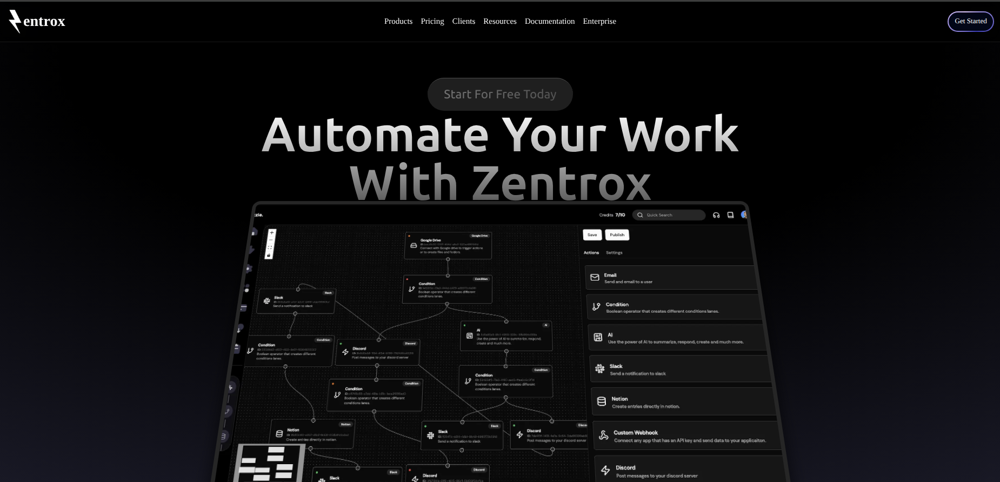
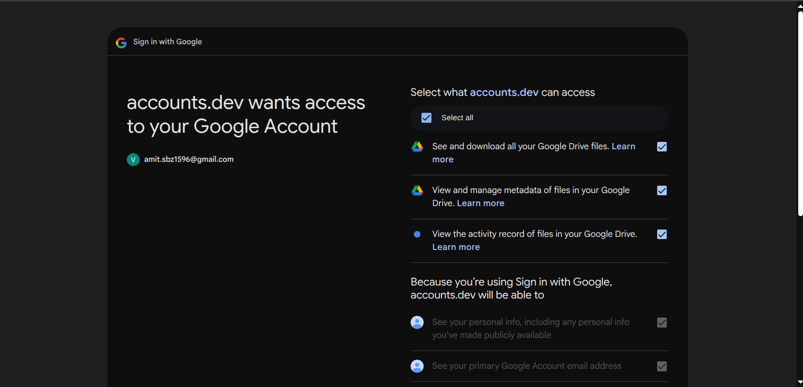

# Zentrox – Autonomous Workflow Automation Tool

## 📌 Project Overview

**Zentrox** is a real-time, no-code workflow automation platform designed for startups and SMEs to automate repetitive business tasks without writing a single line of code. Built on modern web technologies, Zentrox offers an intuitive drag-and-drop builder, seamless third-party integrations, and lightning-fast webhook-based triggers for real-time automation.

---

## 🎯 Project Objectives

- Reduce manual and repetitive tasks.
- Improve operational efficiency.
- Provide real-time automation using webhook-based triggers.
- Offer a user-friendly no-code interface for all users, including non-developers.
- Support a wide range of third-party integrations (Slack, Google Drive, Notion, Discord).
- Enable affordable automation with a flexible pricing model.

---

## 🚀 Key Features

- 🔗 **Drag-and-drop Workflow Builder** – Create custom workflows easily.
- ⚡ **Real-time Webhook Triggers** – Faster execution with no polling delays.
- 🔐 **Role-Based Access Control** – Secure authentication using [Clerk.dev](https://clerk.dev).
- 🔧 **Integrations** – Google Drive, Notion, Slack, Discord, and more.
- 💾 **Database** – PostgreSQL with Prisma ORM.
- 💰 **Monetization** – Subscription system integrated using Stripe API.
- 🧑‍💻 **Developer Support** – REST API endpoints, logs, and modular architecture.

---#### 🧠 Workflow Builder UI

#### 💰 Pricing Page

#### 🔐 Drive Permission Setup

#### 🔁 Node-Based Workflow Builder

#### 📁 Google Drive Setup Panel

## 🛠️ Tech Stack

| Layer        | Technology                |
|--------------|---------------------------|
| Frontend     | Next.js 14 + Tailwind CSS |
| Backend      | Next.js API Routes        |
| Authentication | Clerk.dev              |
| Database     | PostgreSQL + Prisma ORM   |
| Webhooks     | Ngrok (development)       |
| Payments     | Stripe API                |

---

## 🧩 System Architecture

Zentrox follows a modular MVC-style architecture:

- **Frontend** handles UI and drag-drop workflow builder.
- **Backend** processes workflows, manages triggers/actions, and handles API/webhooks.
- **Database** stores user data, workflows, logs, and execution history.

Webhook-based communication allows real-time, event-driven task execution from external services.

---

## ⚙️ How It Works

1. **User Authentication:** Secure login via Clerk with OAuth and social logins.
2. **Workflow Design:** Users define triggers and actions via a visual editor.
3. **Webhook Registration:** Webhooks are created to listen to third-party events.
4. **Execution:** When an event occurs (e.g., file uploaded in Google Drive), Zentrox executes the defined action.
5. **Logging:** Results are logged and user is notified via UI.

---

## 📈 Experimental Results

| Metric                     | Result                     |
|----------------------------|----------------------------|
| Trigger-to-Action Latency | < 2 seconds                |
| Concurrent Users Tested   | 10,000+                    |
| Uptime During Testing     | 98.9%                      |
| CPU + Memory Utilization  | < 70% on 2-core, 4GB RAM   |

---

## 📚 References

- [Clerk.dev Authentication Docs](https://clerk.dev/docs)
- [Ngrok Documentation](https://ngrok.com/docs)
- [Prisma ORM Docs](https://www.prisma.io/docs)
- [Zapier Pricing](https://zapier.com/pricing)
- IEEE Xplore Paper: “Real-Time and Scalable Workflow Automation”

---

## 🧪 Future Enhancements

- Replace ngrok with production-grade tunnel (e.g., reverse proxy server).
- Add AI-based workflow recommendations.
- Enable self-hosted deployment.
- Optimize backend with caching and rate-limiting for high-scale usage.

---

## 👨‍🎓 About the Author

**Vikash Kumar Kharwar**  
B.Tech CSE, 6th Semester  
National Institute of Technology, Mizoram  
Enrollment No.: BT22CS035

Under the guidance of:
- Dr. C. Lalengmawia
- Dr. Megha Saha

---

## 📅 Date of Submission

**22nd April 2025**

---

## 📝 License

This project is licensed under the [MIT License](LICENSE).

